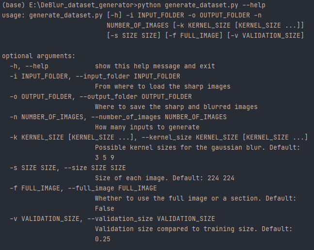

# DeBlur Dataset Generator
This project lets you:
* Create train and validation folders containing **sharp / blurred images**
* Choose **section** or **full image** to use as train / val samples
* Choose possible **gaussian blur** kernel sizes

## How It Works
###Arguments

###Example
    python generate_dataset.py -i "G:/sharp_images_of_cats" -o "G:/dataset" -n 100 -k 3 9 27 -s 224 224
Will create train and validation folders in G:/dataset containing:
* **-n 100** => 100 images total between training and validation
* **-s 224 224** => each image will be 224 by 224 pixels
* **-k 3 9 27** => each image may be blurred with a kernel size of 3, 9 or 27